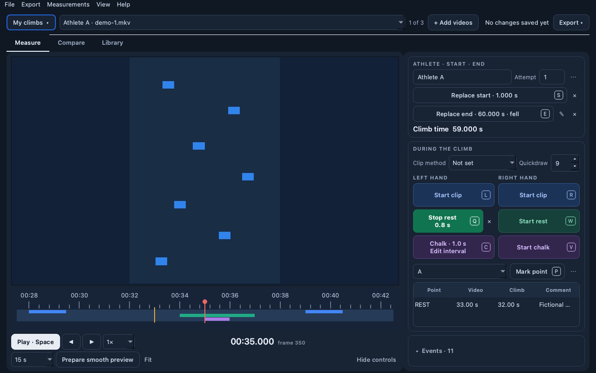
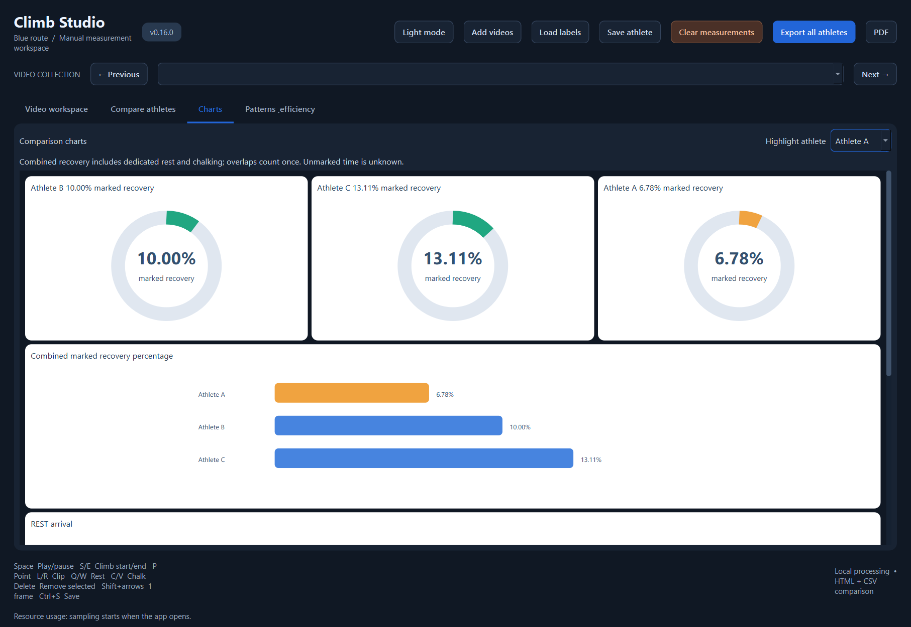

# Climb Studio

Fully local human-assisted climbing measurements for Windows and Apple Silicon macOS.
Automatic inference remains a feasibility experiment, not a validated autonomous pipeline.



## Screenshots

All screenshots below use generated pixels and fictional measurements. No real
climbers, footage or telemetry are included.




[Light workspace](docs/screenshots/workspace-light.png) ·
[Athlete comparison table](docs/screenshots/athlete-comparison.png)

For another coding model, start with [AGENTS.md](AGENTS.md) and the
[installation handoff](docs/INSTALL_FOR_AGENTS.md).

## Install

Download the latest installer from
[Releases](https://github.com/slawek-private/climbing-efficiency-analyzer/releases/latest):
`Climb-Studio-…-macOS-arm64.dmg` (Apple Silicon, macOS 14+) or
`Climb-Studio-…-Windows-x64-setup.exe` (Windows 10/11). Builds are not yet
signed or notarised: on macOS use **System Settings → Privacy & Security → Open
Anyway** on first launch; on Windows choose **More info → Run anyway**. The
installed app keeps measurements, caches and exports in `Documents/Climb Studio`.

## Run from source

Install uv 0.8.22 and Python 3.12.11, then:

```sh
uv sync --locked
uv run --no-sync python -m viewer
```

Windows: `tools/windows/start_manual_viewer.cmd`.
Mac: `tools/macos/start_manual_viewer.command` after [macOS setup](docs/SETUP_MACOS.md).
macOS source support and an Apple Silicon CI job are provided; M3 Pro interactive validation remains required.

Three places: **Measure** one climb, **Compare** climbs (table, charts, patterns,
side by side) and **Library**. Measurements save automatically; drop videos onto
the window to start.

Organise work in **projects** (one per event or route, e.g. “SYCC Genf”) and
export a project, optionally with its videos, as one `.climbproject` file.
**Library** shows each video's resolution, frame rate, codec and storage
needs, and prepares smooth previews in bulk in the background; **Storage** limits
and frees the preview cache. **Side by side** plays several attempts next to each
other, aligned at the climb start or a named point, sized to fill the screen.
Installed apps update themselves from GitHub Releases after checking the
installer's SHA-256 and release compatibility manifest (OS, architecture and
supported source versions). Downloads wait for an explicit restart. Recording
tips and the guided tour are available from Help, when you want them.

**0.20.1:** collision-safe autosave, recoverable missing videos, separate saved
attempts, collapsible measuring controls, shared comparison selection, dynamic
checkpoint/quickdraw charts, and preview queues with disk-space safeguards.
See [release notes](docs/RELEASE_0.20.1.md).

Mark climb start/end (fall or top), shared points, timestamped comments, and
left/right rest, clip and chalk timers. Compare multiple athletes, view live
charts, use precise frame stepping and a zoomable timeline, save/load labels
by video checksum, and export local HTML/CSV/PDF reports. Choose **Prepare
smooth preview** for direct frame access when 4K scrubbing is slow.
See [controls](docs/MANUAL_VIEWER.md) and [metric definitions](docs/COMPARISON_REQUIREMENTS.md).

## Generate reports

```sh
uv run --no-sync python -m viewer.report_cli --labels videos --output artifacts/reports/comparison.html --focus "Athlete A" --pdf artifacts/reports/comparison.pdf
```

An existing HTML snapshot is also accepted with `--source` instead of `--labels`.
[Report generation](docs/REPORTS.md) describes precision, provenance and limitations.
Combined recovery includes chalking, merging overlaps once. Missing data is
unknown. Rest percentages do not prove why an athlete fell.

## Build installers

```sh
uv sync --locked --group build
uv run --no-sync python packaging/build.py   # writes build/release/
```

Builds the installer for the current platform with PyInstaller, runs the bundled
app's `--self-check`, then packages a `.dmg` (macOS) or Inno Setup `setup.exe`
(Windows, needs Inno Setup 6). Pushing a tag that matches `viewer/version.py`
(e.g. `v0.17.0`) runs `.github/workflows/release.yml`, which builds both on CI
and publishes a GitHub Release.

## Tests and optional Windows inference

```sh
uv run --no-sync python -m pytest viewer -q
```

Windows CUDA feasibility tools require `uv sync --locked --extra analysis`.
[Windows setup](docs/SETUP.md) and [model sources/licences](docs/MODELS.md).
The manual viewer does not need model weights, CUDA or cloud APIs. CI uses
synthetic fixtures only, on Windows and macOS arm64.

## Roadmap: models trained with SageMaker

The ultimate goal is to use **Amazon SageMaker accelerated computing** (GPU
training instances) to train models that enable more advanced video analysis:
automatically proposing climb start and end, hand–hold contacts, clips, rests
and chalking, and eventually body position and movement efficiency.

The frame-accurate measurements made in Climb Studio are the foundation: every
label is tied to an exact frame and to the checksum of the original video, which
makes them suitable as training and evaluation data.

Planned principles:

- **Opt-in only.** Footage or labels are used for training only with the explicit
  consent of the people filmed, and only for datasets the user chooses to share.
- **Humans stay in control.** Model output will be presented as suggestions to
  review and correct in the existing editor, never as unreviewed measurements.
- **Local first.** The app keeps working fully offline; trained models are meant
  to run on the user's own computer.

Today none of this is implemented: the app makes no cloud or model calls, and
the optional Windows inference tools remain a feasibility experiment.

## Private footage and telemetry

Videos, images, labels, athlete telemetry, caches, generated reports and
historical footage-specific M0 reports remain local and ignored by Git.
The only network request is the optional update check: a plain HTTPS request
to the GitHub Releases API, at most daily, sending no identifiers (turn it off in
Help › Check for updates automatically).
Only reusable source, schemas, synthetic tests, lockfiles and setup documentation
are committed. No telemetry, footage uploads or external assets are required.

## License

[MIT](LICENSE)
